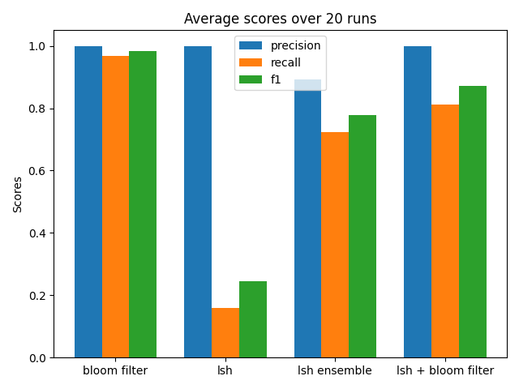

# Nearest neighbor search on overlap similarity
In this project, we investigate the problem of nearest neighbor search using overlap similarity. 
Nearest neighbor search over jaccard similarity can be well solved through a combination of minhash and LSH.
However, when changing the similarity measure to overlap, things become more challenging because there is not a LSHable sketch for overlap similarity.

## Problem Definition
`input`: a set *s*, threshold *t*

`output`: all sets that have overlap similarities larger than *t* with *s* 

## Methods

### Bruteforce

We do pairwise overlap similarity computations on the cadidate column with all other columns and find the nearest neighbors under a given similarity threshold.

#### This is our analysis baseline.

### LSH

We run LSH on all the columns under a given similarity threshold to get the "Index" (indicating nearest neighbors of the columns). Then we get the nearest neighbors of the cadidate column from the "Index". We will compute the result's Precision, Recall, F1 by comparing with the baseline.

### LSH Ensemble (SOTA)

### Bloom Filter

### LSH + Bloom Filter

## Progress Update
1. Implemented a data generator that can generate sets of various lengths while maintain a certain degree of overlap.
    - can easily tune the distribution of set sizes and overlap degree
2. Finished implementation for all five methods
3. Came up with evaluation metrics and plans
4. Ran simple experiments to compare the five methods.
5. Result running on a smaller dataset:

## Next Step
1. Generate larger datasets, run more benchmarking and make detailed plot.
2. Analyze the trade offs of different methods.

## Usage
### Generate dataset
run `dataGenerator.py`
### Generate bloom filters
run `bloom_filter.py`
### Generate minhash signature
run `LSH.py`
### Benchmarking
run `main.py`
